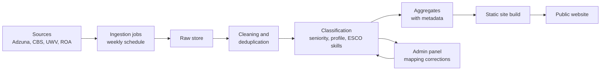

# Requirements: HBO-ICT Job Market Insights Website

As of 2026-09-19

## 1. Purpose and scope

The website gives HBO bachelor IT students in the Netherlands an up-to-date, transparent view of the ICT job market, so they can choose a specialisation, internship and first job with evidence. It translates vacancy, salary and trend data into student terms: roles, skills and junior-level prospects per study programme.

**In scope**

- Dutch ICT job market, with focus on junior, graduate and internship positions; regional detail for Noord-Holland (Alkmaar, Haarlem, Amsterdam) and national figures alongside
- Vacancy volumes, in-demand skills, starting salaries and trends over time
- Mapping of market data to three ICT programmes: Informatica, Business IT & Management and Technische Informatica
- Public methodology and source documentation for every figure

**Out of scope (first release)**

- A job board or application functionality
- Personal career advice, accounts or CV matching
- Markets outside the Netherlands, except as later comparison
- MBO and WO programmes as primary audience
- Non-ICT programmes such as Toegepaste Wiskunde

**Background.** Existing labour market dashboards (UWV, Intelligence Group, Jobdigger) target employers and policymakers. None present the market per study programme at junior level with open methods.

## 2. Stakeholders and users

Students are the primary users; the site is owned, run and funded personally by the author, independent of the hogeschool.

| Stakeholder | Role | Main interest |
| --- | --- | --- |
| HBO-ICT students (year 1–4) at hogescholen in Alkmaar, Haarlem and Amsterdam | Primary user | Which skills, profiles and roles lead to work in their region |
| HBO-ICT students elsewhere in the Netherlands | Secondary user | The national picture per profile and skill |
| Prospective students | Secondary user | Is ICT a good study choice, which profile fits |
| Study career coaches (SLB) | Secondary user | Evidence for coaching conversations |
| Curriculum committees | Secondary user | Signals on skills missing from the curriculum |
| Internship and graduation office | Secondary user | Which sectors and regions offer placements |
| Author (private owner and funder) | Owner | Credible tool with low running costs and maintenance time |
| Data providers (e.g. Jobdigger, Adzuna) | Supplier | Correct attribution, licence compliance |

**Personas**

- **Sanne, prospective student, choosing a programme.** Wants to compare Informatica and Technische Informatica on openings, junior salaries and growth.
- **Youssef, 3rd year, looking for an internship.** Wants to know which skills appear most in junior vacancies in his region.
- **Mark, curriculum coordinator.** Wants yearly skill-demand trends to justify course changes.

## 3. Data sources and data requirements

The MVP combines one live vacancy feed with free public statistics; commercial data is a later upgrade. Availability, licence terms and API limits below are based on general knowledge and must be verified before build.

| Source | Data | Refresh | Access | Release |
| --- | --- | --- | --- | --- |
| Adzuna API | NL vacancies: title, text, location, salary where given | Daily | Free API key, attribution required | MVP |
| CBS StatLine | Vacancies and employment by sector | Quarterly | Open data API | MVP |
| ROA (Maastricht) | Labour market forecasts by education type | Every 2 years | Public reports | MVP |
| HBO-Monitor | Graduate starting salary and job match per programme | Yearly | Public tables / via hogeschool | MVP |
| ESCO | Skills and occupations taxonomy | Per release | Open, EU licence | MVP |
| UWV | Occupation outlook, regional labour market | Quarterly | Public | MVP |
| Jobdigger or Textkernel Jobfeed | Deduplicated NL vacancy data with classifications, including multi-year history for skill trends | Daily | Paid licence; no hogeschool licence available, likely beyond a personal budget | Phase 2 |
| Stack Overflow Developer Survey | Technology usage and popularity | Yearly | Open licence | Phase 2 |

**Data requirements**

- DR-01: Every stored record keeps its source, retrieval timestamp and licence.
- DR-02: Vacancies are deduplicated on normalised title, employer and location within a 30-day window.
- DR-03: Each vacancy is classified by seniority (internship, junior, medior, senior, unknown).
- DR-04: Each ICT vacancy is mapped to zero or more of the three programmes via defined role families, e.g. software developer to Informatica, business or functional analyst to Business IT & Management, embedded or IoT engineer to Technische Informatica.
- DR-05: Skills are extracted from vacancy text and linked to ESCO skill codes.
- DR-06: Dutch and English postings are both processed.
- DR-07: Raw vacancy texts are kept no longer than the licence allows; aggregates are kept indefinitely for trend history.
- DR-08: Scraping of sites whose terms forbid it (e.g. LinkedIn, Indeed) is not allowed.
- DR-09: Historical series are loaded as far back as each source allows, with a target of at least 5 years for CBS, UWV and HBO-Monitor data. Vacancy-level trends (skills, junior share) start at the first ingestion date because no historical vacancy dataset is available.

## 4. Functional requirements

Priorities use MoSCoW: Must and Should form the MVP; Could and Won't are deferred.

| ID | Requirement | Priority |
| --- | --- | --- |
| FR-01 | Dashboard with total ICT vacancies, junior share and trend; defaults to the last 12 months | Must |
| FR-02 | Programme pages for each of the three programmes: vacancy volume, top 15 skills, typical job titles, starting salary | Must |
| FR-03 | Skills overview: most requested skills, filterable by programme and seniority, with change vs. previous period | Must |
| FR-04 | Salary overview: junior salary ranges from HBO-Monitor and vacancy data, with sample size | Must |
| FR-05 | Every chart shows source, last update date and number of records behind it | Must |
| FR-06 | Methodology page explaining collection, cleaning, classification and known limitations | Must |
| FR-07 | Filters for region (province and labour market region), seniority and time period; Noord-Holland shown next to the national figure by default | Must |
| FR-08 | Trends page: rising and declining skills, roles, vacancy volumes and salaries, explorable over 1, 2, 5 years or the full available history per source, with series start and methodology breaks marked | Should |
| FR-09 | Programme comparison: two programmes side by side | Should |
| FR-10 | Bilingual interface (Dutch and English) | Should |
| FR-11 | Download of aggregated data as CSV | Should |
| FR-12 | Internship view: sectors and regions with most internship postings | Could |
| FR-13 | Skill-to-course mapping showing where the curriculum covers each skill | Could |
| FR-14 | Periodic trend summary written by staff or generated and reviewed | Could |
| FR-15 | Links to sample vacancies at the original source | Could |
| FR-16 | User accounts, personalised advice, CV matching | Won't (this release) |

**Admin functions**

- FR-20: Admin can view ingestion status, errors and record counts per source.
- FR-21: Admin can correct profile and skill mappings; corrections are logged.
- FR-22: Admin can publish a changelog entry when methodology changes.

## 5. Non-functional requirements

| ID | Category | Requirement |
| --- | --- | --- |
| NFR-01 | Freshness | Vacancy data refreshed at least weekly; statistics within 30 days of publication |
| NFR-02 | Performance | Pages load in under 2 seconds on a 4G mobile connection |
| NFR-03 | Availability | 99% uptime during the academic year |
| NFR-04 | Usability | Mobile-first; a first-year student finds a programme's top skills in under 3 clicks |
| NFR-05 | Accessibility | WCAG 2.1 level AA (required for Dutch public institutions) |
| NFR-06 | Maintainability | Documented code, automated tests on the data pipeline, handover guide so someone else can take over |
| NFR-07 | Reliability | A failed ingestion never overwrites published data; the site shows the last good snapshot |
| NFR-08 | Security | No personal data of users stored; admin access protected with two-factor authentication |
| NFR-09 | Cost | Running costs under €50 per month in the MVP |
| NFR-10 | Portability | Runs on common low-cost cloud hosting without vendor lock-in |

## 6. Transparency and methodology

Transparency is the site's main differentiator, so these requirements are all Must.

- TR-01: Each figure links to its source and shows the retrieval or publication date.
- TR-02: Each figure shows its sample size; figures based on fewer than 30 records are hidden or clearly marked as indicative.
- TR-03: The methodology page describes deduplication, seniority classification, profile mapping and skill extraction in plain language.
- TR-04: Known limitations are listed, e.g. vacancies are not hires, salary is missing in many postings, ghost vacancies and recruiter reposts exist.
- TR-05: Classification accuracy is measured on a manually labelled sample of at least 200 vacancies and published per release.
- TR-06: A public changelog records methodology changes and breaks in trend series.
- TR-07: The site states who owns it, who funds it, and that no employer pays for placement.
- TR-08: Users can report an error or a wrong mapping via a simple form.

## 7. Legal, privacy and ethics

The main legal risk is data licensing, not privacy; as a private publisher, the author carries this risk personally, so every source's terms are checked before launch.

- LR-01: Use only sources whose terms allow this use; store licence terms per source.
- LR-02: Respect the EU database right: publish aggregates, not bulk copies of vacancy databases.
- LR-03: Remove personal data found in vacancy texts (recruiter names, emails, phone numbers) before storage.
- LR-04: GDPR: no tracking cookies; use privacy-friendly analytics without consent banners where lawful.
- LR-05: Do not rank or name individual employers negatively.
- LR-06: Avoid steering students with overconfident predictions; forecasts are labelled as scenarios with uncertainty.
- LR-07: Check skill and title mappings for bias, e.g. gendered job titles or language excluding non-Dutch speakers.
- LR-08: Do not use hogeschool names or logos in a way that suggests official endorsement; state that the site is independent.

## 8. Architecture outline

A scheduled batch pipeline feeds a static front end; no live database queries from the public site.

The pipeline publishes only when validation passes, which keeps the last good snapshot online (NFR-07). A suggested stack is Python for ingestion and classification, PostgreSQL for storage, and a static site generator with a charting library for the front end; the team may choose alternatives that meet the NFRs.

## 9. Roadmap, risks and success metrics

The MVP is sized at about 20 weeks for a team of 3–5 people; built alone and part-time, expect roughly twice as long.

| Phase | Duration | Deliverables |
| --- | --- | --- |
| 0. Preparation | 3 weeks | Data licences checked, role families per programme defined, labelled sample of 200 vacancies |
| 1. MVP | 12 weeks | FR-01 to FR-06, weekly Adzuna ingestion, CBS, HBO-Monitor and ROA data, methodology page |
| 2. Pilot | 5 weeks | Test with 30+ students and 3 coaches; fix usability and mapping issues; launch |
| 3. Extension | Next semester | Should and Could requirements, growing vacancy trend history |

**Risks**

| Risk | Impact | Mitigation |
| --- | --- | --- |
| Single-person dependency: owner runs out of time or budget | Site goes stale | Fully automated ingestion, near-zero running costs, visible data age, handover guide |
| Vacancy API terms change or access ends | No live data | Abstract the ingestion layer; keep a second source ready |
| Poor profile or seniority classification | Misleading figures | Labelled test set, published accuracy, admin corrections |
| Low junior sample sizes per region | Unreliable charts | Minimum-sample rule (TR-02); aggregate to national level |
| Students distrust or ignore the site | Low impact | Involve students in design; share via SLB coaches and study associations |

**Success metrics (first year)**

- At least 40% of the programme's students visit the site at least once.
- Classification accuracy of at least 80% on the labelled sample.
- Data never older than 14 days for more than 5% of the year.
- At least one curriculum discussion cites the site.

**Decisions**

- Owner and funder: the author, personally.
- No Jobdigger or similar vacancy dataset is available; vacancy trends start at first ingestion.
- Programmes covered: Informatica (Haarlem), Business IT & Management (Alkmaar, Amsterdam), Technische Informatica (Alkmaar). Toegepaste Wiskunde (Amsterdam) is out of scope to keep the site purely ICT.
- Audience: primarily students in Alkmaar, Haarlem and Amsterdam, with a national audience as secondary.
